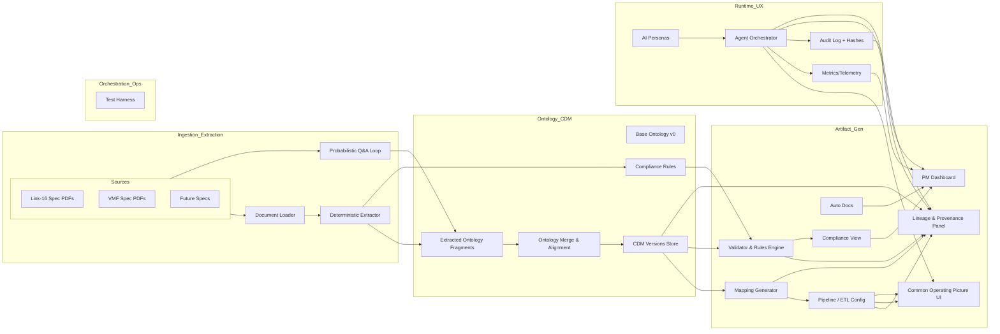
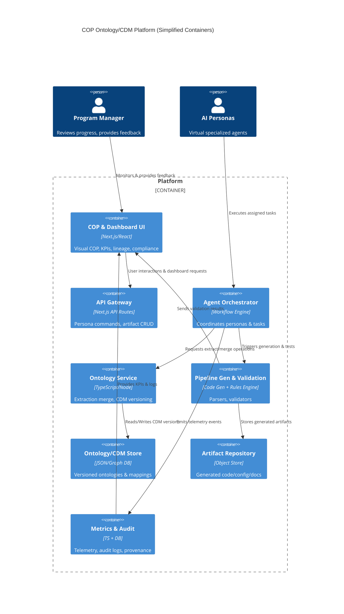
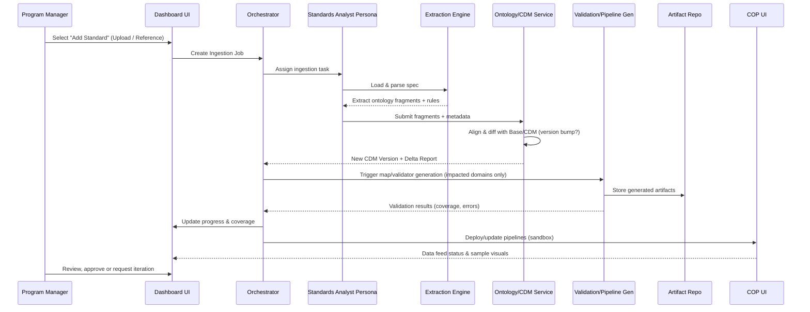
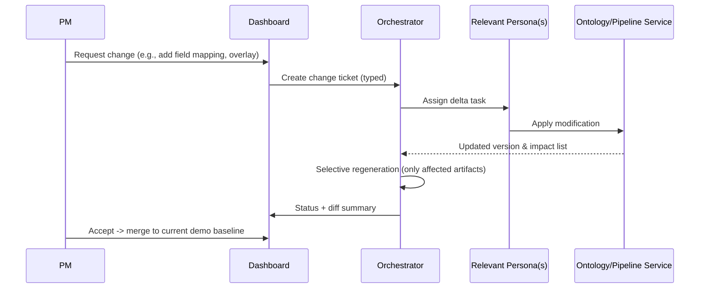
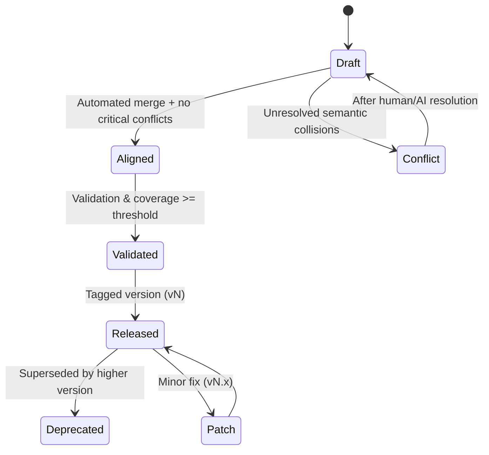

# Blue Force COP – UI & Process Supplemental (Draft for Stakeholder Working Session)

Version: 0.1 (draft)  
Date: 2025-08-13  
Owner:   
Intended Audience: 

---
## 1. Purpose
Provide a visual + structured companion to the storyboard to:
- (a) validate shared mental model
- (b) elicit missing requirements for the UI/UX and underlying agentic workflow
- (c) surface versioning & governance expectations for ontology → Common Data Model (CDM) evolution, and 
- (d) frame KPIs for demo and eventual MVP

---
## 2. Narrative Synthesis (from Storyboard + Prompt Understanding)
We demonstrate an Agentic AI platform that ingests multiple military data standards (starting: Link-16, VMF; later others), extracts ontology fragments, merges them with a base ontology, and incrementally evolves a versioned Common Data Model. Generated artifacts (mappings, validators, pipelines, visualization prototypes) are orchestrated and surfaced via a COP interface plus a PM dashboard that shows progress, coverage, compliance, and lineage. Personas (virtual agents) collaborate with provenance and auditability. As new standards are added, ontology deltas trigger CDM version bumps, re-validation, and selective regeneration of impacted downstream assets.

---
## 3. High-Level Architecture (Conceptual)


---
## 4. C4 Container View (Simplified)


---
## 5. Sequence – Adding a New Standard (Deterministic Path)


---
## 6. Sequence – PM Feedback Iteration


---
## 7. Data Model / Ontology Evolution Lifecycle


---
## 8. UI Concept Areas (Wireframe Descriptions)
- Top Nav: Modes (Dashboard / COP / Lineage / Compliance / Ontology Explorer / Settings)
- Left Sidebar (Dashboard): Standards list with status badges (Ingesting, Needs Review, Validated, Deployed)
- Main Panel (Dashboard):
  - Progress Timeline (phases 0–10) with live % bars
  - KPI Tiles: Time Remaining, Coverage %, Validation Pass Rate, Active Personas, Latency (p95)
  - Event Stream: Persona actions, version bumps, validation failures
- Ontology Explorer: Tree of concepts (CDM version selector) + delta highlight vs. previous
- Compliance View: Table – Rule ID | Source | Coverage | Violations | Severity | Linked Artifact
- Lineage Panel: Graph (Spec Section → Ont Concept → CDM Field → Mapping → Validator → Pipeline → Visualization Widget)
- COP UI: Map/Visualization area with overlays toggle (Link-16, VMF, Combined), symbology, sample message feed, status pills
- Feedback Drawer: PM inputs change requests; auto-classifies (Mapping, Visualization, Ontology, Validation)

---
## 9. Key Features (Proposed) Categorized
| Category | Feature | MVP? | Notes |
|----------|---------|------|-------|
| Ingestion | Multi-spec upload & metadata capture | Yes | Start with Link-16, VMF |
| Extraction | Deterministic parser & coverage metric | Yes | Deterministic first |
| Extraction | Probabilistic refinement loop | Stretch | Confidence & convergence chart |
| Ontology | Version diff & semantic conflict detection | Yes | Highlight merges |
| CDM | Incremental version bump w/ impact analysis | Yes | Partial regen |
| Mapping | Auto map + manual override | Yes | Human-in-loop later |
| Validation | Rule execution & coverage dashboard | Yes | Threshold gating |
| Orchestration | Persona task queue + audit trail | Yes | Basic events |
| Deployment | Sandbox pipeline deploy w/ health | Yes | Minimal runtime |
| Visualization | COP overlay + compliance & lineage views | Yes | Basic symbology toggle |
| Feedback | Change request workflow | Yes | Tag & log decisions |
| Metrics | Latency, coverage, success rates | Yes | Export JSON/CSV |
| Reproducibility | Bundle export (prompts + artifacts) | Stretch | Archive zip |

---
## 10. KPIs & Metrics (Demo-Oriented)
- Coverage: Extracted rule coverage ≥ 95% (target), show live progression
- Validation Pass Rate: ≥ 99% for mandatory fields; error classes enumerated
- Time to Integrate New Standard: < 5 min from upload to validated mappings (demo path)
- Selective Regeneration Ratio: > 80% unchanged artifacts preserved after adding second standard
- Ontology Conflict Resolution Time: < 60s (demo scenario)
- COP Data Latency (ingest → visualize): < 2s p95
- Audit Completeness: 100% persona actions hashed & timestamped

---
## 11. Stakeholder Question Bank (Use During Meeting)
### Strategic / Value
1. What primary decision or workflow should the PM accelerate with this tool?  
2. Which future standards (beyond Link-16, VMF) are highest priority?  
3. How critical is explainability vs. pure automation?  

### Ontology & Data Model
4. Do we need support for multiple CDM branches (e.g., experimental vs. stable)?  
5. Required granularity of provenance (field-level, rule-level, section-level)?  
6. Tolerance for ontology churn during multi-standard onboarding?  

### Validation & Compliance
7. What categories of validation errors must block progression?  
8. Are there external compliance frameworks we must reference (STANAG IDs, etc.)?  

### UI/UX Expectations
9. Preferred primary dashboard KPIs (rank top 5).  
10. Need dark map / tactical theme or standard neutral theme first?  
11. Should lineage be graph-based, tabular, or hybrid initially?  

### Workflow & Governance
12. Is human approval required before CDM version increments are ‘Released’?  
13. SLA for responding to a PM change request?  
14. What audit retention period is mandated?  

### Personas & Automation Depth
15. Should personas be visible as entities (avatars/log) or abstracted into actions?  
16. Manual override capability for mapping suggestions at MVP?  

### Deployment & Environments
17. Is sandbox isolation (per standard addition) required or shared sandbox acceptable?  
18. Any need for air-gapped/offline operation in roadmap?  

### Metrics & Reporting
19. Export formats for reports (PDF, JSON, CSV)?  
20. Need automated narrative summaries (LLM-based) in MVP?  

### Risk & Security
21. Do we expect classified inputs later? (Implications for architecture)  
22. Identity & auth provider preference?  

### Stretch / Vision
23. Interest in probabilistic extraction early or defer?  
24. Appetite for simulation integration (AFSIM) in MVP vs. Phase 2?  
25. Need scenario replay/time travel in COP?  

---
## 12. Risks & Mitigations
| Risk | Impact | Mitigation |
|------|--------|------------|
| Ontology merge complexity escalates with each new standard | Slow iteration | Modular domain partitions + impact analysis |
| Over-automation reduces trust | User resistance | Transparent lineage & diff visualization |
| Performance regression after version bump | Latency spike | Benchmark gate in CI for pipelines |
| Validation rule explosion (maintenance burden) | Drift & noise | Rule templates + grouping + prioritization tiers |
| Scope creep in COP visuals | Delayed MVP | Lock initial overlay set (Link-16, VMF, Combined) |

---
## 13. Incremental Demo Roadmap (Phased)
1. Phase A (Week 1-2): Deterministic extraction + ontology diff + basic dashboard
2. Phase B (Week 3): Mapping & validation gen + COP overlays (static feed)
3. Phase C (Week 4): Selective regen + lineage graph + persona audit trail
4. Phase D (Week 5): Probabilistic refinement prototype + reproducibility bundle

---
## 14. Open Decisions (Track During Meeting)
- CDM storage tech (Graph DB vs. JSON + index)
- Required approval workflow for version promotion
- Initial KPI shortlist
- Priority of probabilistic extraction
- Depth of lineage UI (graph libs vs. minimal tree)
- AuthN/AuthZ approach (OIDC? local only?)

---
## 15. Glossary (Working)
- CDM: Common Data Model – unified schema aggregated from multiple standards.
- Ontology Fragment: Structured set of concepts/relations extracted per standard.
- Coverage: % of targeted spec elements represented as ontology or validation rules.
- Selective Regeneration: Rebuilding only artifacts impacted by ontology/CDM changes.
- Persona: AI role performing specialized tasks with provenance.

---
## 16. Next Immediate Actions (Post-Meeting)
- Consolidate stakeholder answers into tracker
- Freeze MVP feature scope & KPI set
- Finalize ontology storage decision
- Kick off Phase A implementation spike

---
## 17. Appendix – Potential Data Structures (Illustrative)
```jsonc
// Ontology Fragment (simplified)
{
  "standard": "Link-16",
  "version": "M.1",
  "extracted_at": "2025-08-13T12:00:00Z",
  "concepts": [
    {"id": "track", "attributes": ["track_id", "lat", "lon", "time"], "relations": ["communicates_with"]}
  ],
  "rules": [
    {"id": "L16-FIELD-001", "description": "track_id required", "severity": "critical"}
  ],
  "coverage": {"sections_total": 120, "sections_extracted": 115}
}
```
```jsonc
// CDM Version Manifest (partial)
{
  "cdm_version": "1.2.0",
  "previous": "1.1.0",
  "delta": {
    "added_concepts": ["message_group"],
    "modified": [{"concept": "track", "added_attributes": ["altitude"]}],
    "removed": []
  },
  "impacted_artifacts": ["validator:track", "mapping:link16.track", "pipeline:ingest.link16"],
  "created_at": "2025-08-13T12:05:00Z"
}
```

---
[✔]
[✖]


(End of Draft)
