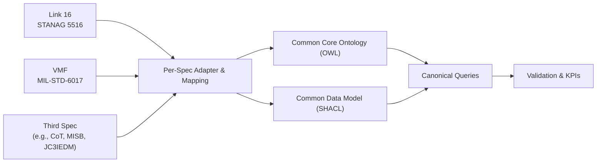
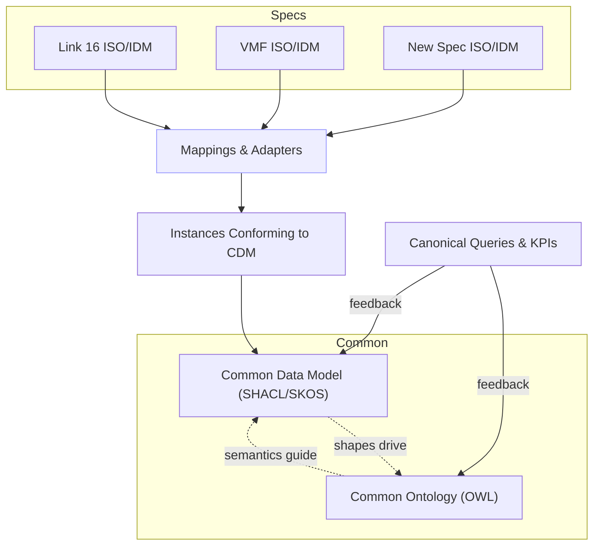

## Middle-Out Ontology Development for Tactical Data Integration

### A Practical Strategy for Link 16, VMF, and Future Specifications

#### Abstract
This paper proposes a middle-out approach to ontology development for integrating tactical data links and related message specifications. Rather than designing a complete common ontology in isolation (top‑down) or exhaustively extracting ontologies from many specifications first (bottom‑up), we define a minimal, testable common core informed by multiple representative sources (e.g., Link 16/STANAG 5516, VMF/MIL‑STD‑6017, and one contrasting feed). Each specification is mapped to the core, with rigorous validation and measurable criteria for fidelity and utility. The approach balances speed-to-value, governance, and long-term extensibility.

#### Keywords
Ontology engineering, data integration, Link 16, STANAG 5516, VMF, MIL‑STD‑6017, JC3IEDM, OWL, SHACL, GeoSPARQL, OWL‑Time, PROV‑O

---

### 1. Introduction
Multi-spec tactical systems must integrate heterogeneous message formats (e.g., Link 16 J‑series, VMF, Cursor-on-Target, MISB video metadata) to support situational awareness, targeting, and C2. A coherent, shared meaning of core concepts—tracks, units, events, observations, identity, geospatial, and time—is essential for fusion, analytics, and consistent user experience. The key design decision is sequencing: build a common ontology first, or extract ontologies from many specs and harmonize later.

We advocate a middle-out strategy: define a small, high‑value common core seeded by several representative specifications, then iteratively map each spec to that core. This avoids designing in a vacuum while preventing a slow, sprawling bottom‑up exercise.

### 2. Related Standards and Models
- OWL and RDF for conceptual semantics
- SHACL for structural constraints and validation of instance data
- GeoSPARQL for geospatial primitives and relationships
- OWL‑Time for temporal instants, intervals, and relations
- PROV‑O for provenance of messages, transformations, and sources
- JC3IEDM/NATO vocabularies as reference points for defense semantics

### 3. Problem Statement
How can we deliver a reusable, governed common ontology and data model that:
- Integrates Link 16 (STANAG 5516) and VMF (MIL‑STD‑6017) as a first tranche
- Onboards additional specs with predictable effort
- Supports canonical fusion queries with acceptable latency and acceptable information loss
- Remains maintainable under evolving standards and operational demands

### 4. Approach: Middle‑Out Ontology Development
We separate the solution into three layers:

1) Conceptual ontology (meaning):
- Formal semantics in OWL for core concepts and relationships
- Minimal initial scope focused on high‑value domains used by near‑term consumers

2) Logical information model (structure):
- SHACL shapes expressing required/optional fields, ranges, and constraints
- Canonical value vocabularies using SKOS; equivalences via `owl:equivalentClass` and `owl:equivalentProperty`

3) Physical mappings and adapters (implementation):
- Per‑spec schemas and adapters (e.g., J‑series, VMF messages) mapped to the logical model
- Declarative mappings when practical (e.g., RML/CSVW), or ETL code with auditable rules

This enables rapid iteration: the core is kept small and pragmatic; mappings provide the bridge; evaluation metrics ensure utility.



#### 4.1 How Common and Individual Models Interact and Co‑Evolve

Definitions
- Common Ontology (CO): OWL classes/properties that capture spec‑agnostic semantics for shared domains (e.g., `Track`, `Observation`, `Identity`).
- Common Data Model (CDM): SHACL shapes and SKOS vocabularies that constrain structure and values for instances expressed in the CO.
- Individual Spec Ontology (ISO): optional, per‑spec terms capturing unique semantics (e.g., J‑series‑specific qualifiers) linked to the CO via `rdfs:subClassOf`, `rdfs:subPropertyOf`, or equivalence.
- Individual Data Model (IDM): per‑spec schema/adapter and mappings that produce data conforming to CDM shapes.

Interaction model
- ISOs/IDMs map spec fields to CO/CDM via adapters; conforming instances validate against CDM shapes.
- When a spec exposes a concept not yet in CO but broadly useful, propose a CO extension; otherwise keep it in ISO and link via subclass/subproperty.
- CO and CDM evolve together: adding a CO term typically introduces or updates a CDM shape; deprecations follow versioning rules.

Growth rules
- Rule 1 (Spec‑agnostic core): Add to CO only when the concept is cross‑cutting (used by ≥2 specs) or required by high‑priority queries.
- Rule 2 (Prefer extension over mutation): Represent spec‑specific nuances in ISO/IDM; avoid changing CO unless semantics are truly general.
- Rule 3 (Alignment first): Use `owl:equivalentClass`, `owl:equivalentProperty`, and SKOS mappings before adding new CO terms.
- Rule 4 (Validation as gate): New mappings must pass CDM SHACL; breaking changes require a major version and a migration note.
- Rule 5 (Promotion threshold): Promote ISO terms to CO when mapping coverage and reuse justify it; deprecate redundant ISO terms with timelines.
- Rule 6 (Round‑trip priority): Maintain lossless round‑trip for priority messages; if CO/CDM cannot support lossless mapping, document controlled loss and rationale.

Co‑evolution loop



Lifecycle
- Onboard new spec → create ISO/IDM and mappings → validate against CDM → gather gaps.
- Propose CO/CDM changes for cross‑cutting gaps → review → version and publish.
- Update adapters → re‑validate → measure KPIs → iterate.

### 5. Core Ontology Scope (Initial)
- Entities and Tracks: `Entity`, `Track`, `Unit`, `Platform`, `ForceAffiliation`
- Events and Tasks: `Event`, `Task`, `Activity`
- Observations and Reports: `Observation`, `Report`, `Detection`, `Classification`
- Identity and Status: `Identity`, `IFF`, `Status`, `Confidence`
- Time: `time:Instant`, `time:Interval`, relations from OWL‑Time
- Geospatial: `geo:Feature`, `geo:Geometry`, positions/velocities via GeoSPARQL
- Messaging and Provenance: `prov:Entity`, `prov:Activity`, `prov:Agent`, lineage between source messages and fused entities

### 6. Mapping Strategy for Link 16 and VMF
- Select representative messages (e.g., Link 16 J3.2, J3.5; corresponding VMF messages) to seed coverage
- Define field‑to‑property mappings, noting units, enumerations, coordinate frames, and cardinality
- Use SKOS for controlled vocabularies; assert equivalences with `owl:sameAs` where appropriate
- Capture lossy vs. lossless transformations; require lossless round‑trip for priority fields
- Validate instance data against SHACL shapes; compute mapping coverage and constraint violations

Example SHACL shape (illustrative):

```turtle
@prefix sh: <http://www.w3.org/ns/shacl#> .
@prefix ex: <http://example.org/ontology#> .
@prefix xsd: <http://www.w3.org/2001/XMLSchema#> .

ex:TrackShape a sh:NodeShape ;
  sh:targetClass ex:Track ;
  sh:property [
    sh:path ex:hasIdentity ;
    sh:class ex:Identity ;
    sh:minCount 1 ;
  ] ;
  sh:property [
    sh:path ex:hasGeometry ;
    sh:nodeKind sh:IRI ;
    sh:minCount 1 ;
  ] ;
  sh:property [
    sh:path ex:reportedAt ;
    sh:datatype xsd:dateTime ;
    sh:minCount 1 ;
  ] .
```

### 7. Evaluation Metrics and Acceptance Criteria
- Mapping coverage: percentage of fields/properties mapped per message type
- Fidelity: lossless round‑trip for priority messages/fields (e.g., J3.2/J3.5)
- Validation: SHACL pass rate for integrated datasets
- Query utility: N canonical fusion queries supported end‑to‑end within latency budget L
- Extensibility: time/effort to onboard a third specification without altering core semantics

### 8. Governance and Evolution
- Versioned ontology (`core.owl`) and shapes (`core.shapes.ttl`) with semantic versioning
- Change management board for concept additions; lightweight process for new mappings
- CI pipelines to validate shapes, run mapping tests, and publish documentation
- Deprecation policy and migration notes for downstream consumers

### 9. Risks and Mitigations
- Over‑generalization of the core: keep scope minimal; require use‑case driven justifications
- Mapping complexity and drift: automate validation; maintain mapping test suites; document assumptions
- Performance of queries: design canonical query set early; index and materialize views where needed
- Standard evolution (message revisions): isolate impact in mapping layer; avoid breaking core unnecessarily

### 10. Lightweight Pilot (4–6 Weeks)
Week 1: Scope and metrics
- Confirm domains in scope and select exemplar messages (e.g., J3.2, J3.5, VMF equivalents)
- Define canonical queries and latency targets; identify consumers

Weeks 2–3: Draft and map
- Draft minimal core ontology (OWL) and SHACL shapes
- Implement per‑spec adapters and field mappings; unit tests for round‑trip fidelity

Week 4: Generality test and refine
- Add a third specification (e.g., CoT, MISB ST 0601, or JC3IEDM extract)
- Measure coverage, SHACL validation, query performance; refine core and mappings

Outputs
- `core.owl`, `core.shapes.ttl`, per‑spec mapping definitions, validation reports, and a decision brief

### 11. Roadmap (Beyond Pilot)
- Expand domain coverage (e.g., EW, ISR, targeting) in prioritized increments
- Enrich value vocabularies with SKOS concept schemes and alignments
- Introduce provenance completeness metrics and lineage visualization
- Harden adapters and deploy a governed registry of mappings and shapes

### 12. Conclusion
A middle‑out ontology strategy provides the fastest path to a usable, governed, and extensible common model for tactical data integration. By seeding a minimal core from multiple representative specifications and rigorously validating mappings, teams can deliver value quickly while preserving a clean path for future onboarding.

### References
- STANAG 5516 (Link 16 J‑Series Messages)
- MIL‑STD‑6017 (Variable Message Format, VMF)
- W3C OWL 2 Web Ontology Language
- W3C Shapes Constraint Language (SHACL)
- OGC GeoSPARQL
- W3C OWL‑Time
- W3C PROV‑O Provenance Ontology
- JC3IEDM (Multinational Interoperability Programme)

### Appendix A: Canonical Queries (Illustrative)
1) Latest position, velocity, and identity for a given track across all sources
2) Tracks within R nautical miles of a point over interval T with affiliation "Hostile"
3) Provenance lineage for a fused entity: source messages, transforms, timestamps
4) Event timeline for a unit with observed classification changes and confidences

### Appendix B: Example Mapping Notes (Illustrative)
- Link 16 J3.2 position fields mapped to `geo:Geometry` with CRS normalization; time stamp to `time:Instant`
- IFF/Mode 5 elements mapped into `ex:Identity` with `Confidence` derived from qualifier fields
- VMF message enumerations aligned to SKOS concept schemes; equivalences asserted where semantics match


### Appendix C: Acronyms and Notes

- **SHACL (Shapes Constraint Language)**: W3C standard to validate RDF data against structural constraints ("shapes"). In this document, SHACL expresses the Common Data Model (CDM) requirements (e.g., a `Track` must have an `Identity`, `Geometry`, and a `reportedAt` time). SHACL runs as a validator, reporting which instances satisfy shapes and where violations occur.
  - Core constructs shown in the example shape:
    - **NodeShape**: a set of constraints that target nodes of a given class or selection.
    - **sh:targetClass**: selects nodes by RDF class for validation.
    - **sh:property**: a property constraint block applied to the focused node.
    - **sh:path**: the RDF property being constrained.
    - **sh:class**: requires the value to be an instance of a given class.
    - **sh:datatype**: requires the value to be a specific literal datatype (e.g., `xsd:dateTime`).
    - **sh:nodeKind**: constrains node kind (e.g., `sh:IRI` vs literal).
    - **sh:minCount / sh:maxCount**: cardinality constraints (minimum/maximum occurrences).
    - Validation output: pass/fail with detailed reports for remediation and CI gating.

- **OWL (Web Ontology Language)**: W3C language for defining classes, properties, and axioms to capture domain meaning and enable reasoning.
- **RDF (Resource Description Framework)**: graph data model using triples (subject–predicate–object) to represent statements about resources.
- **SKOS (Simple Knowledge Organization System)**: model for controlled vocabularies, concept schemes, and mappings among terms.
- **GeoSPARQL**: OGC standard for representing and querying geospatial data in RDF, including geometry literals and spatial functions.
- **OWL‑Time**: W3C ontology for temporal concepts such as instants, intervals, and temporal relations.
- **PROV‑O (Provenance Ontology)**: W3C ontology for describing provenance of data, including entities, activities, and agents.
- **JC3IEDM (Joint Consultation, Command and Control Information Exchange Data Model)**: NATO/MIP conceptual data model used as a reference for defense semantics.
- **STANAG (Standardization Agreement)**: NATO standard; here, STANAG 5516 defines Link 16 J‑series messages.
- **VMF (Variable Message Format)**: DoD messaging standard defined by **MIL‑STD‑6017** for tactical information exchange.
- **MIL‑STD (Military Standard)**: U.S. DoD standards; e.g., MIL‑STD‑6017 defines VMF.
- **CoT (Cursor‑on‑Target)**: lightweight XML/JSON event schema used for tactical reporting and situational awareness.
- **MISB ST 0601**: Motion Imagery Standards Board metadata standard for FMV (full‑motion video) UAS platforms.
- **KPI (Key Performance Indicator)**: measurable criterion used to evaluate mappings and system behavior (e.g., validation pass rate, latency).
- **CRS (Coordinate Reference System)**: spatial reference defining how coordinates map to positions on Earth; required for geometry normalization.
- **IFF (Identification Friend or Foe)**: system and data used to identify platform affiliation and modes (e.g., Mode 5).
- **ETL (Extract, Transform, Load)**: process/pipeline to ingest data from sources, transform to the common model, and load for use.
- **RML (RDF Mapping Language)**: declarative language to map heterogeneous data sources to RDF.
- **CSVW (CSV on the Web)**: W3C standard for annotating CSVs with metadata for transformation and validation.
- **IRI (Internationalized Resource Identifier)**: Unicode‑capable generalization of URI; used for identifying RDF resources.
- **C2 (Command and Control)**: activities and systems used to direct and coordinate military operations.
- **EW (Electronic Warfare)**: military use of the electromagnetic spectrum; listed as a future domain.
- **ISR (Intelligence, Surveillance, Reconnaissance)**: information collection and processing activities; listed as a future domain.
- **CO (Common Ontology)**: spec‑agnostic OWL ontology capturing shared semantics across specifications.
- **CDM (Common Data Model)**: SHACL shapes and SKOS vocabularies that constrain and validate instances of the CO.
- **ISO (Individual Spec Ontology)**: in this document, a per‑spec ontology for unique semantics, linked to CO via subclass/subproperty or equivalence (not the ISO standards body).
- **IDM (Individual Data Model)**: per‑spec schema/adapter and mappings that produce instances conforming to the CDM.


